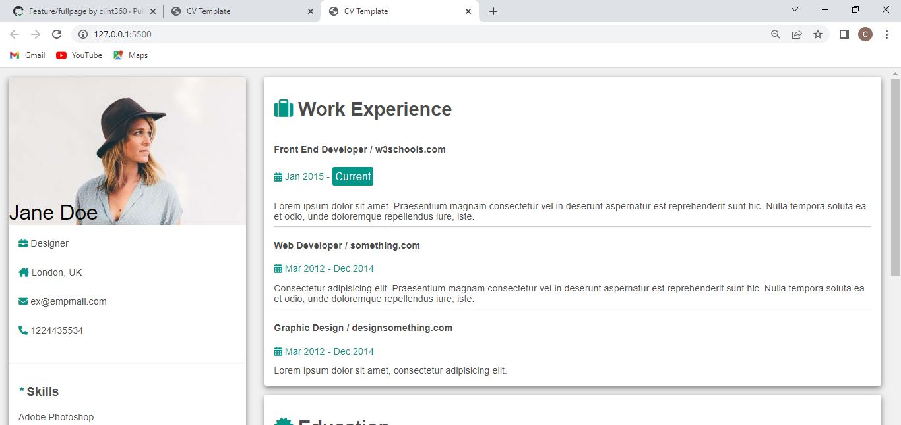

# CV TEMPLATE

A web designed curriculum vitae that gives a detailed account of personal data and accomplishments.

## App

### Built With

- HTML
- CSS

### Prerequisites

Google Chrome, basic html, css.
  
## Clone project

- To get a local copy up and running follow these simple example steps.
- Clone this repository with `https://github.com/clint360/cvtemplate.git` using your terminal.
- Change to the project directory by entering: cd block in the terminal.

## steps

- $ git clone `https://github.com/clint360/cvemplate`
- $ `cd cvtemplate`
- $ `git checkout feature/fullpage`

## Start App

- run by opening the index.html in the browser

## Author

👤 **clint360**

- GitHub: [@clint360](https://github.com/clint360)

## 📝 License

This project is [w3school](./LICENSE) licensed.
